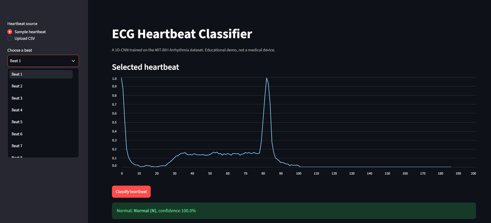
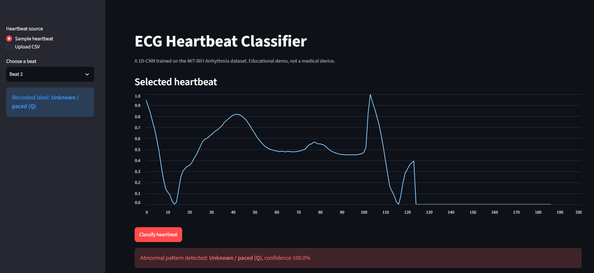

# ECG Cardio Dashboard: Heartbeat Arrhythmia Classifier

A two-service web app that classifies single ECG heartbeats into five arrhythmia categories using a 1D convolutional neural network built in PyTorch. A FastAPI backend serves the model, and a Streamlit dashboard lets you pick or upload a heartbeat and see the prediction.

**Live demo**

- Dashboard: https://ecg-cardio-dashboard-frontend.onrender.com
- API (interactive docs): https://ecg-cardio-dashboard.onrender.com/docs

> **Note on cold starts:** both services run on Render's free tier, which puts a service to sleep after about 15 minutes without traffic. The first request after a quiet period can take roughly a minute (up to about two if both services are asleep). This is expected behavior, not a bug. Once awake, predictions are fast.

> **Disclaimer:** this is an educational project. It is not a medical device and must not be used for diagnosis or clinical decisions.

**Author:** Yallamanda Rao Gonuguntla | **Project date:** October 2026

---

## Screenshots

| Normal beat (green result) | Abnormal beat (red result) |
|---|---|
|  |  |

---

## 1. Problem

Arrhythmias are abnormal heart rhythms, and patient-monitoring systems need to flag abnormal heartbeats automatically. This project asks a focused version of that question: given one pre-segmented ECG heartbeat (187 samples), which of five beat categories does it belong to?

The goals were to:

1. build and compare a classical machine-learning baseline against a deep-learning model,
2. handle a heavily imbalanced dataset honestly (accuracy alone is misleading here), and
3. deploy the trained model as a working web application, not just a notebook.

## 2. Data

- **Source:** MIT-BIH Arrhythmia Database, in the pre-processed Kaggle version (https://www.kaggle.com/datasets/shayanfazeli/heartbeat).
- **Size:** 87,554 training beats and 21,892 test beats.
- **Format:** each row is one heartbeat with 187 time steps (values scaled to the 0 to 1 range), followed by an integer class label.
- **Classes:**

| Label | Class | Test beats |
|---|---|---|
| 0 | N: Normal | 18,118 |
| 1 | S: Supraventricular ectopic | 556 |
| 2 | V: Ventricular ectopic | 1,448 |
| 3 | F: Fusion | 162 |
| 4 | Q: Unknown / paced | 1,608 |

The classes are strongly imbalanced: about 83% of beats are Normal and Fusion beats are well under 1%. A model that always predicted "Normal" would score about 83% accuracy while detecting nothing, so **macro-F1** (the unweighted average of per-class F1) is used as the main comparison metric alongside accuracy.

The dataset files are not included in this repository (see "Reproducing the training" below).

## 3. Approach

### 3.1 Baselines (scikit-learn)

A Decision Tree and a Random Forest (100 trees) were trained on the 187 raw features with `class_weight="balanced"`, using the dataset's provided train/test split.

### 3.2 1D-CNN (PyTorch)

Input shape: `(batch, 1, 187)`.

```
Conv1d(1 -> 16, k=5)  + BatchNorm + ReLU + MaxPool(2)     187 -> 93
Conv1d(16 -> 32, k=5) + BatchNorm + ReLU + MaxPool(2)      93 -> 46
Conv1d(32 -> 64, k=5) + BatchNorm + ReLU + MaxPool(2)      46 -> 23
Flatten (64 x 23 = 1472) -> Linear(64) + ReLU + Dropout(0.3) -> Linear(5)
```

About 107589 parameters; the saved weights are under 0.5 MB.

**Training setup**

- 10% of the training set held out as a stratified validation set; the test set was used only for final evaluation.
- Cross-entropy loss with class weights equal to the square root of the "balanced" weights (see below).
- Adam-style optimizer, learning rate 1e-3, batch size 128, `ReduceLROnPlateau` on validation macro-F1.
- 30 epochs per run on a Kaggle T4 GPU; the checkpoint with the best validation macro-F1 was kept.

### 3.3 Experiments

The first CNN (v1) used the full "balanced" class weights. It caught most rare-class beats but produced many false alarms (precision for S and F was around 0.53 to 0.55 on the test set). Five variants were compared on the validation set with identical data and training recipe:

| Run | Change | Val macro-F1 |
|---|---|---|
| A | Baseline (full balanced weights) | 0.828 (3-seed mean) |
| B | Softer weights (square root of balanced) | 0.913 (3-seed mean) |
| C | B + BatchNorm | **0.925** (3-seed mean) |
| D | C + noise and time-shift augmentation | 0.896 (single seed) |
| E | C with wider layers + weight decay + augmentation | 0.897 (3-seed mean) |

Findings: softer class weights gave the largest improvement. BatchNorm added a small, more stable gain. Augmentation and a wider model did not help. One plausible reason for augmentation hurting is that the beats are already aligned, so shifting them removes useful position information, but this was not tested. Run C had the most consistent results across seeds and the best balance of precision and recall on the rare classes, so it became the final model (the seed was chosen by validation score, not test score).

## 4. Results

All numbers below are on the **held-out test set** (21,892 beats), evaluated once after the model was chosen.

| Model | Accuracy | Macro-F1 |
|---|---|---|
| Decision Tree | 0.955 | 0.806 |
| CNN v1 (full balanced weights) | 0.961 | 0.841 |
| Random Forest | 0.977 | 0.891 |
| **CNN v2 (final, deployed)** | **0.986** | **0.927** |

Per-class results for the final CNN:

| Class | Precision | Recall | F1 | Support |
|---|---|---|---|---|
| N | 0.992 | 0.995 | 0.993 | 18,118 |
| S | 0.893 | 0.815 | 0.852 | 556 |
| V | 0.965 | 0.959 | 0.962 | 1,448 |
| F | 0.818 | 0.858 | 0.837 | 162 |
| Q | 0.993 | 0.990 | 0.991 | 1,608 |

The rare classes S and F remain the hardest (F1 around 0.84 to 0.85), but the softer class weighting and BatchNorm roughly balanced their precision and recall, compared with v1 where recall was high and precision low.

## 5. System architecture

```
Browser  ->  Streamlit frontend (Render)  --HTTP/JSON-->  FastAPI backend (Render)  ->  PyTorch model
```

- **Backend (`backend/`)**: FastAPI app that loads the model once at startup and exposes:
  - `GET /health`: returns `{"status": "ok", "model_loaded": true}`
  - `POST /predict`: takes exactly 187 numbers and returns the predicted class, confidence and all class probabilities. Invalid input (wrong length or non-finite values) is rejected with HTTP 422.
  - CORS middleware is enabled.
- **Frontend (`frontend/`)**: Streamlit app. Choose one of 20 sample test beats or upload a one-row CSV, view the waveform, and click **Classify**. Normal results show in a green box and abnormal results in a red box, with a bar chart of class probabilities. The backend address is read from the `API_URL` environment variable.

Example request and response:

```json
POST /predict
{"values": [0.98, 0.91, 0.69, ... 187 numbers in total ...]}

{
  "predicted_class": 0,
  "label": "Normal (N)",
  "is_abnormal": false,
  "confidence": 0.998,
  "probabilities": {"Normal (N)": 0.998, "Supraventricular ectopic (S)": 0.001, "...": "..."}
}
```

## 6. Limitations

- **Possible patient overlap between train and test.** The pre-processed dataset has no patient identifiers, so it cannot be verified that train and test beats come from different patients. If they overlap, the reported scores are optimistic compared with performance on a new patient. A patient-wise split would be the first thing to add.
- **Beat-level classification only.** The model needs an already-segmented, normalized 187-sample beat. It does not detect beats in a raw ECG recording or analyze rhythm across several beats.
- **Single dataset and lead.** Results come from one dataset (MIT-BIH); behavior on other devices, leads, noise levels or populations is unknown.
- **Rare classes.** S and F have few examples (556 and 162 test beats), so their metrics are noisy: a handful of beats changes the score noticeably.
- **Overconfidence.** The network often outputs probabilities very close to 1.0, including for some wrong predictions. Confidence should not be read as certainty.
- **Model selection.** Hyperparameters and the checkpoint were chosen on a validation split taken from the training data, with a small number of seeds per configuration. Differences of about 0.02 macro-F1 between variants are within the noise.
- **Not clinically validated.** This is a coursework demonstration only.
- **Free-tier hosting.** Services sleep when idle and run on small CPUs, so first requests are slow.

## 7. Future work

- Patient-wise train/test split and cross-validation
- Probability calibration (for example temperature scaling) so confidence is more trustworthy
- Beat detection from raw ECG, and rhythm-level models across several beats
- Larger architectures or residual networks, with more systematic hyperparameter search
- Model monitoring and a persistent (non-sleeping) deployment

## 8. Repository structure

```
ecg-cardio-dashboard/
├── backend/
│   ├── main.py              # FastAPI app (/health, /predict)
│   ├── model.py             # CNN definition (must match the saved weights)
│   ├── ecg_model.pth        # trained weights (final CNN)
│   ├── test_api.py          # sends test beats to the API
│   └── requirements.txt
├── frontend/
│   ├── app.py               # Streamlit dashboard
│   ├── sample_heartbeats.csv
│   └── requirements.txt
├── notebooks_or_scripts/    # EDA, baseline models, CNN training(2 versions)
├── results/                 # saved metrics (baseline and CNN)
├── docs/screenshots/        # images used in this README
└── data/                    # dataset (not tracked; see below)
```

## 9. Run it locally

**Prerequisites:** Python 3 and Git.

```bash
git clone https://github.com/Yelli05/ecg-cardio-dashboard.git
cd ecg-cardio-dashboard

python -m venv venv
# Windows (PowerShell):  venv\Scripts\Activate.ps1
# macOS / Linux:         source venv/bin/activate

pip install -r backend/requirements.txt
pip install -r frontend/requirements.txt
```

`backend/requirements.txt` installs the CPU-only build of PyTorch, which is much smaller than the default GPU build.

**Terminal 1: start the API**

```bash
cd backend
uvicorn main:app --reload
```

Check it at http://127.0.0.1:8000/health and http://127.0.0.1:8000/docs.

**Terminal 2: start the dashboard** (from the project root, with the venv active)

```bash
streamlit run frontend/app.py
```

It opens at http://localhost:8501 and talks to `http://127.0.0.1:8000` by default. To point it at a different backend, set the `API_URL` environment variable first, for example in PowerShell: `$env:API_URL = "https://ecg-cardio-dashboard.onrender.com"`.

### Reproducing the training

1. Download the MIT-BIH CSVs (`mitbih_train.csv`, `mitbih_test.csv`) from the Kaggle https://www.kaggle.com/datasets/shayanfazeli/heartbeat and place them in `data/`.
2. Run the notebooks in `notebooks_or_scripts/`. The CNN was trained on a Kaggle GPU notebook (T4).
3. Optional API check against real test beats: `python backend/test_api.py` (needs the test CSV in `data/`).

## 10. Tech stack

Python, PyTorch, scikit-learn, pandas, NumPy, Matplotlib, FastAPI, Uvicorn, Streamlit, Requests, Render, Git/GitHub.

## 11. Data and acknowledgments

- Moody GB, Mark RG. *The impact of the MIT-BIH Arrhythmia Database.* IEEE Engineering in Medicine and Biology Magazine, 2001.
- Goldberger AL et al. *PhysioBank, PhysioToolkit, and PhysioNet.* Circulation, 2000.
- Pre-processed heartbeat version from the Kaggle "ECG Heartbeat Categorization Dataset".